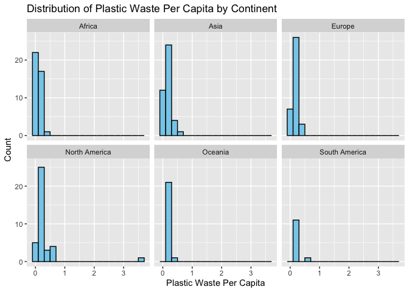
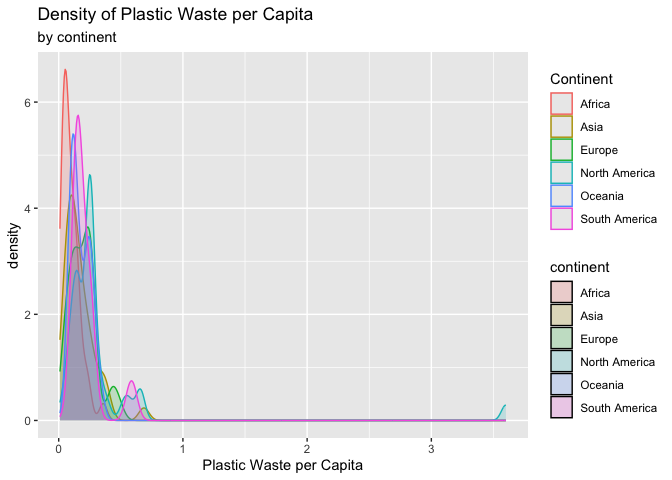
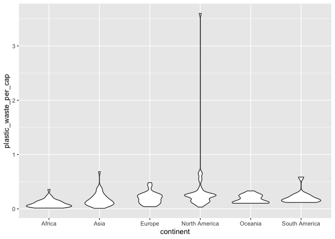
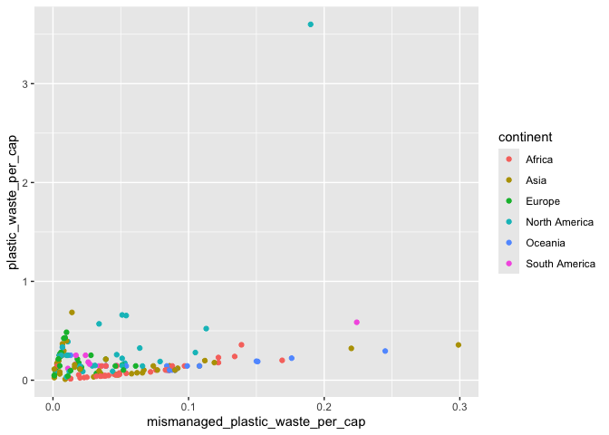
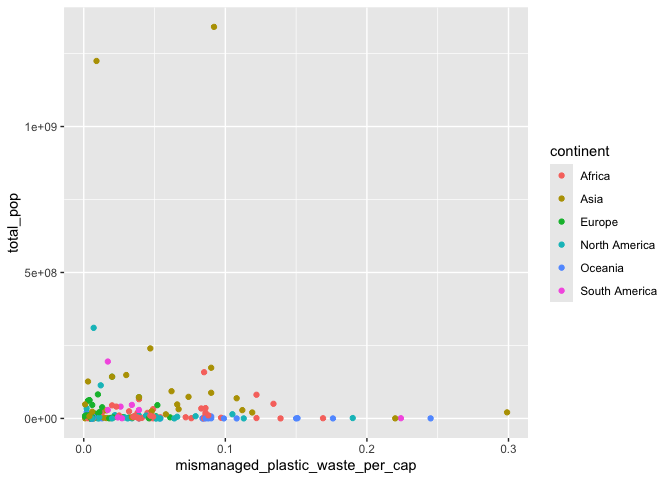
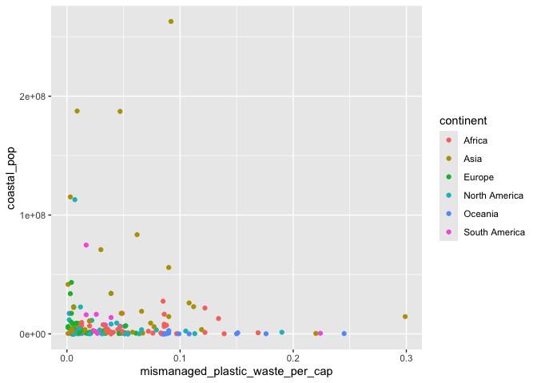
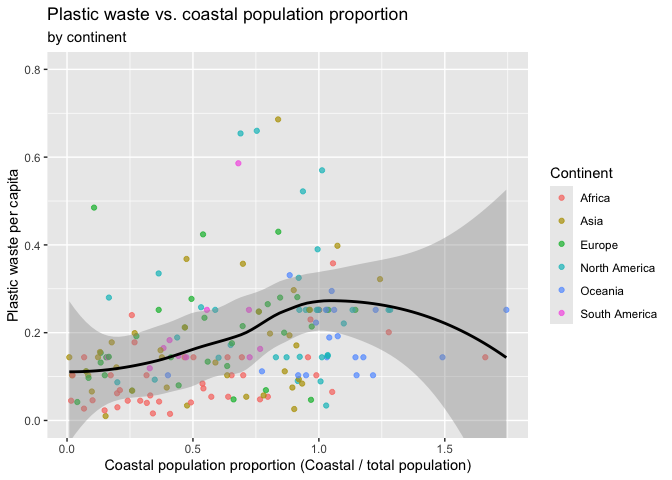

Lab 02 - Plastic waste
================
Julie Garrison
Jan 5 2025

## Load packages and data

``` r
library(tidyverse) 
```

``` r
plastic_waste <- read.csv("data/plastic-waste.csv")
```

## Exercises

### Exercise 1

Plot, using histograms, the distribution of plastic waste per capita
faceted by continent. What can you say about how the continents compare
to each other in terms of their plastic waste per capita?

Africa, Asia, South America: These continents mostly show low levels of
plastic waste per capita, likely due to less industrialization and lower
levels of single-use plastic consumption. Europe: Europe shows a
moderate distribution, likely due to higher consumption but also
potentially better waste management practices. North America: North
America shows higher plastic waste per capita, likely due to high
consumer behavior and many single-use plastics.

``` r
ggplot(data = plastic_waste, aes(x = plastic_waste_per_cap)) +
  geom_histogram(binwidth = 0.2, fill = "skyblue", color = "black") +
  facet_wrap(~ continent) +
  labs(
    title = "Distribution of Plastic Waste Per Capita by Continent",
    x = "Plastic Waste Per Capita",
    y = "Count"
  )
```

    ## Warning: Removed 51 rows containing non-finite outside the scale range
    ## (`stat_bin()`).

<!-- -->

### Exercise 2

Recreate the density plots above using a different (lower) alpha level
that works better for displaying the density curves for all continents.

``` r
ggplot(
  data = plastic_waste,
  mapping = aes(
    x = plastic_waste_per_cap,
    color = continent,
    fill = continent
  )
) +
  geom_density(alpha = 0.2) +
 labs(
    title = "Density of Plastic Waste per Capita",
    subtitle = "by continent",
    x = "Plastic Waste per Capita",
    color = "Continent"
  )
```

    ## Warning: Removed 51 rows containing non-finite outside the scale range
    ## (`stat_density()`).

<!-- -->

Color and fill are mapped to continent because they are determined by
the data. Alpha is set globally in geom_density() because it applies
uniformly and does not depend on the data.

### Exercise 3

Violin plots are useful for understanding the detailed shape of the
data, while box plots are good at summarizing key statistical values and
highlighting outliers more clearly.

``` r
ggplot(
  data = plastic_waste,
  mapping = aes(
    x = continent,
    y = plastic_waste_per_cap
  )
) +
  geom_violin()
```

    ## Warning: Removed 51 rows containing non-finite outside the scale range
    ## (`stat_ydensity()`).

<!-- -->

### Exercise 4

Visualize the relationship between plastic waste per capita and
mismanaged plastic waste per capita using a scatterplot. Describe the
relationship.

4.1 As plastic waste per capita increases, mismanaged plastic waste per
capita tends to increase

``` r
ggplot(
  data = plastic_waste,
  mapping = aes(
    x = mismanaged_plastic_waste_per_cap,
    y = plastic_waste_per_cap,
    color = continent,

  )
) +
  geom_point()
```

    ## Warning: Removed 51 rows containing missing values or values outside the scale range
    ## (`geom_point()`).

<!-- -->

4.2 Developed regions (Europe and North America) tend to have higher
plastic waste per capita with relatively lower mismanaged plastic waste,
suggesting better management practices. Developing regions (Africa and
Asia) tend to have lower plastic waste per capita but proportionally
higher levels of mismanaged plastic waste, highlighting infrastructure
gaps.

4.3 Visualize the relationship between plastic waste per capita and
total population as well as plastic waste per capita and coastal
population. You will need to make two separate plots. Do either of these
pairs of variables appear to be more strongly linearly associated?

``` r
ggplot(
  data = plastic_waste,
  mapping = aes(
    x = mismanaged_plastic_waste_per_cap,
    y = total_pop,
    color = continent,
  )
) +
  geom_point()
```

    ## Warning: Removed 61 rows containing missing values or values outside the scale range
    ## (`geom_point()`).

<!-- -->

``` r
ggplot(
  data = plastic_waste,
  mapping = aes(
    x = mismanaged_plastic_waste_per_cap,
    y = coastal_pop,
    color = continent,
  )
) +
  geom_point()
```

    ## Warning: Removed 51 rows containing missing values or values outside the scale range
    ## (`geom_point()`).

<!-- -->

The relationship between mismanaged plastic waste per capita and coastal
population appears to be more linearly associated than the relationship
with total population

### Exercise 5

``` r
ggplot(
  data = plastic_waste, 
  mapping = aes(
    x = coastal_pop/total_pop, 
    y = plastic_waste_per_cap, 
    color = continent
    )) +
  geom_point(alpha = 0.7) +
  geom_smooth( color = "black", se = TRUE) +
  coord_cartesian(ylim = c(0, .8)) +

  

  labs(
    title = "Plastic waste vs. coastal population proportion",
    subtitle = "by continent",
    x = "Coastal population proportion (Coastal / total population)",
    y = "Plastic waste per capita",
    color = "Continent"
  )
```

    ## `geom_smooth()` using method = 'loess' and formula = 'y ~ x'

    ## Warning: Removed 61 rows containing non-finite outside the scale range
    ## (`stat_smooth()`).

    ## Warning: Removed 61 rows containing missing values or values outside the scale range
    ## (`geom_point()`).

<!-- -->
